# DFP Architecture Documentation

**NVIDIA Morpheus Digital Fingerprinting - System Architecture:**

This document provides comprehensive architectural documentation for the Digital Fingerprinting Platform (DFP) implementation, covering system design, data flows, component interactions, and deployment patterns.

## Table of Contents

- [Executive Summary](#executive-summary)
- [System Architecture](#system-architecture)
- [Training Pipeline Architecture](#training-pipeline-architecture)
- [Inference Pipeline Architecture](#inference-pipeline-architecture)
- [Pipeline Orchestration](#pipeline-orchestration)
- [Module Architecture](#module-architecture)
- [Data Flow Diagrams](#data-flow-diagrams)
- [Control Message Routing](#control-message-routing)
- [MLflow Integration](#mlflow-integration)
- [Kafka Streaming Architecture](#kafka-streaming-architecture)
- [Deployment Architectures](#deployment-architectures)
- [Cache Management](#cache-management)
- [Security Architecture](#security-architecture)

---

## Executive Summary

### System Overview

The Digital Fingerprinting Platform (DFP) implements NVIDIA's Morpheus DFP architecture for user behavior anomaly detection. The system uses unsupervised AutoEncoder neural networks to learn normal behavioral patterns per user and detect deviations that may indicate security threats.

**Key Characteristics:**

- **Pattern**: NVIDIA Morpheus DFP modular pipelines (training + inference)
- **Model**: DFEncoder AutoEncoder (unsupervised learning)
- **Processing**: Per-user models with generic fallback
- **Architecture**: Separate training and inference pipelines with shared cache
- **Integration**: MLflow model registry, Kafka streaming (real-time)
- **Deployment**: CPU/GPU cross-platform support

### Design Principles

1. **NVIDIA Alignment**: Follows official NVIDIA Morpheus DFP patterns
2. **Cache Continuity**: Shared cache between training and inference
3. **Modularity**: Loosely coupled components with clear interfaces
4. **Scalability**: Supports batch and streaming modes
5. **Observability**: Comprehensive logging and MLflow tracking
6. **Extensibility**: Plugin architecture for custom features

---

## System Architecture

### High-Level Architecture

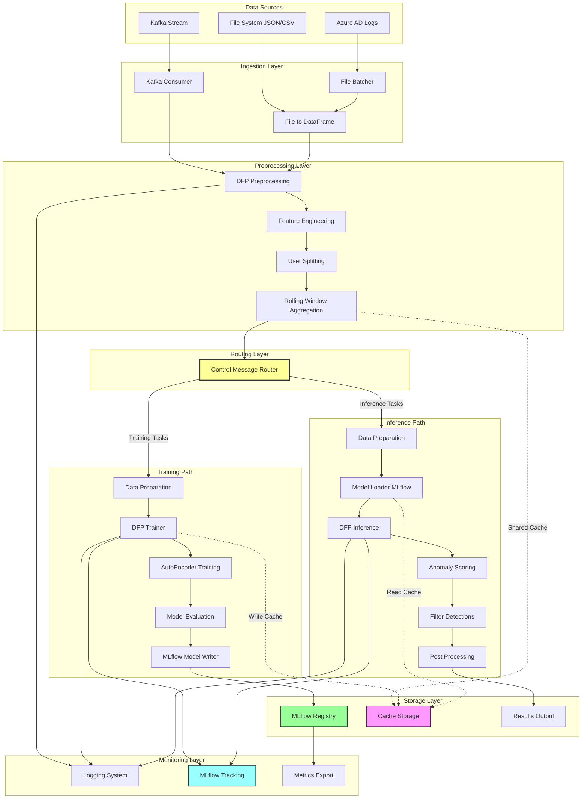

### Architecture Layers

#### 1. Ingestion Layer

**Responsibility**: Load data from various sources into standardized format

**Components**:

- **FileBatcher**: Batches files by time period (daily, hourly)
- **FileToDataFrame**: Loads JSON/CSV/Parquet into pandas DataFrames
- **KafkaConsumer**: Consumes events from Kafka topics

**Input Formats**:

- JSON Lines (`.jsonl`)
- JSON arrays (`.json`)
- CSV (`.csv`)
- Parquet (`.parquet`)

**Output**: Pandas DataFrame with standardized schema

#### 2. Preprocessing Layer

**Responsibility**: Transform raw data into model-ready features

**Components**:

- **DFPPreprocessing**: Schema-based feature extraction
- **FeatureEngineering**: Temporal, categorical, increment features
- **GeographicFeatures**: Travel pattern feature engineering
- **UserSplitting**: Split data by user_id
- **RollingWindow**: Time-based aggregation (24h windows)

**Transformations**:

- DateTime parsing and feature extraction
- Categorical encoding (one-hot/label)
- Increment counters (apps, locations, devices)
- Geographic feature engineering:
  - Haversine distance calculation between consecutive user events
  - Time delta computation (hours between events)
  - Travel velocity calculation (km/h)
  - travel_speed_kmph included in AutoEncoder training (models learn normal patterns)
- Aggregation statistics (count, mean, std, min, max)

**Output**: Per-user aggregated feature DataFrames (including travel_speed_kmph feature)

#### 3. Routing Layer

**Responsibility**: Route data to appropriate pipeline path

**Component**:

- **ControlMessageRouter**: Routes based on task type

**Routing Logic**:

```python
if task_type == "training":
    route_to_training_path()
elif task_type == "inference":
    route_to_inference_path()
```

#### 4. Training Path

**Responsibility**: Train per-user AutoEncoder models

**Flow**:

1. **Data Preparation**: Select features, create train/val split
2. **Model Training**: Train AutoEncoder on user data
3. **Model Evaluation**: Compute baseline statistics
4. **Model Storage**: Save to MLflow Registry

**Artifacts**:

- Trained model (`.pth`)
- Baseline statistics (mean reconstruction error, std)
- Training metrics (loss curves, learning rate)
- Model metadata (user_id, version, timestamp)

#### 5. Inference Path

**Responsibility**: Detect anomalies using trained models

**Flow**:

1. **Model Loading**: Load user-specific or generic model
2. **Inference**: Compute reconstruction errors
3. **Anomaly Scoring**: Calculate z-scores for all features
4. **FilterDetections**: NVIDIA standard binary filtering (mean_abs_z > 2.0)
5. **Output**: Comprehensive detection messages with feature details

**Outputs**:

- Anomaly detections (CSV/JSON)
- Comprehensive feature details (features array, top_features string)
- Z-scores and reconstruction errors
- Model version metadata
- Detection summary statistics

#### 6. Storage Layer

**Responsibility**: Persist models, cache, and results

**Components**:

- **MLflow Registry**: Model versioning and storage
- **Cache Storage**: Rolling window cache (disk-based)
- **Results Output**: Detection results (files/Kafka)

#### 7. Monitoring Layer

**Responsibility**: Observability and performance tracking

**Components**:

- **Logging System**: Structured logging (rotating files)
- **MLflow Tracking**: Experiment tracking and metrics
- **Metrics Export**: Prometheus-compatible metrics (future)

---

## Training Pipeline Architecture

### Training Pipeline Flow

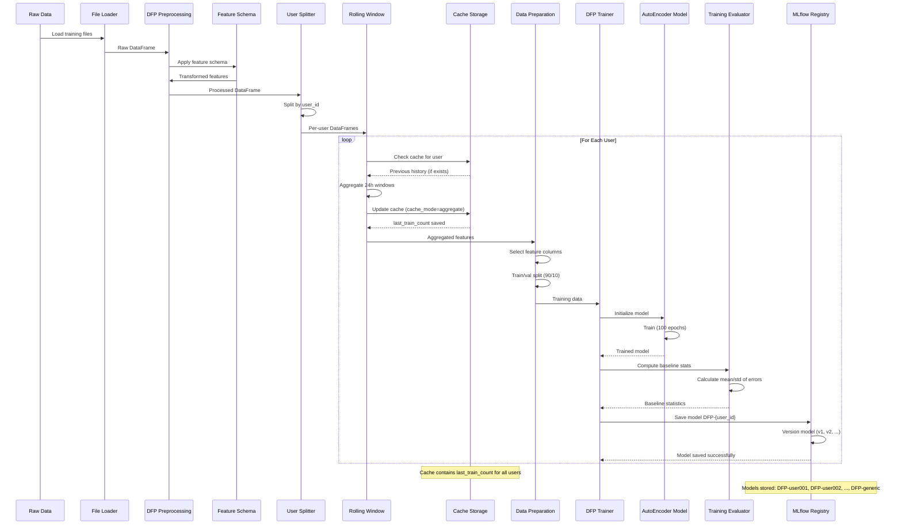

### Training Component Interactions

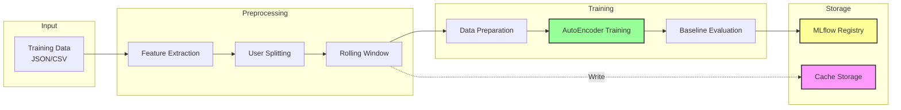

### Training Configuration Flow

**Control Message (train.json)**:

```json
{
  "tasks": [
    {
      "type": "training",
      "properties": {
        "data_path": "data/input/train/azure_ad_train.jsonl",
        "user_id": "*",
        "timestamp_column": "timestamp"
      }
    }
  ]
}
```

**Processing Flow**:

1. Load control message from `control_messages/train.json`
2. Extract training properties (data_path, user_id, etc.)
3. Load data from specified path
4. Apply preprocessing with feature schema
5. Split by user_id (min 300 events per user)
6. Apply rolling window (cache_mode="aggregate", max_history="60d")
7. Train AutoEncoder per user (100 epochs)
8. Save to MLflow as `DFP-{username}` and `DFP-generic`

**Outputs**:

- Per-user models in MLflow Registry
- Cache populated with `last_train_count`
- Training metrics logged to MLflow experiment

---

## Inference Pipeline Architecture

### Inference Pipeline Flow

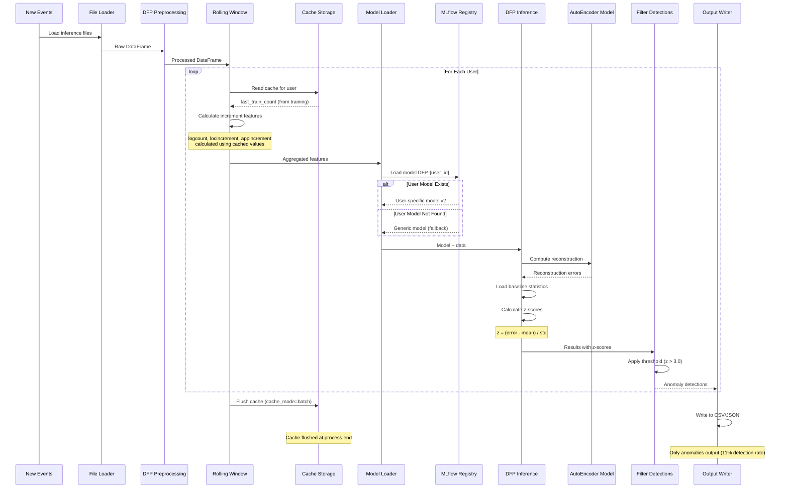

### Inference Component Interactions

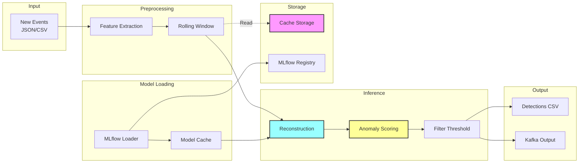

### Inference Configuration Flow

**CLI Command**:

```bash
python pipelines/pipeline.py inference \
    --config config/pipeline.yaml \
    --kafka-bootstrap 127.0.0.1:29092 \
    --input-topic dfp-events \
    --output-topic dfp-detections \
    --poll-interval 10millis
```

**Processing Flow**:

1. Connect to Kafka broker (127.0.0.1:29092)
2. Subscribe to input topic (dfp-events)
3. Poll for events every 10ms (NVIDIA default)
4. Apply preprocessing (same schema as training)
5. Apply rolling window (cache_mode="batch", max_history="1d", reads cache)
6. Load models from MLflow (user-specific or generic)
7. Compute reconstruction errors
8. Calculate z-scores using baseline statistics
9. Filter anomalies (z > 3.0)
10. Publish detections to dfp-detections topic

**Outputs**:

- Anomaly detections (CSV/JSON)
- Z-scores and reconstruction errors
- Model version metadata
- Detection summary statistics

---

## Pipeline Orchestration

### Modular Pipeline Pattern

The modular pipeline pattern uses **separate training and inference pipelines** with **shared cache directory**. This follows NVIDIA's modular DFP architecture for production deployments.

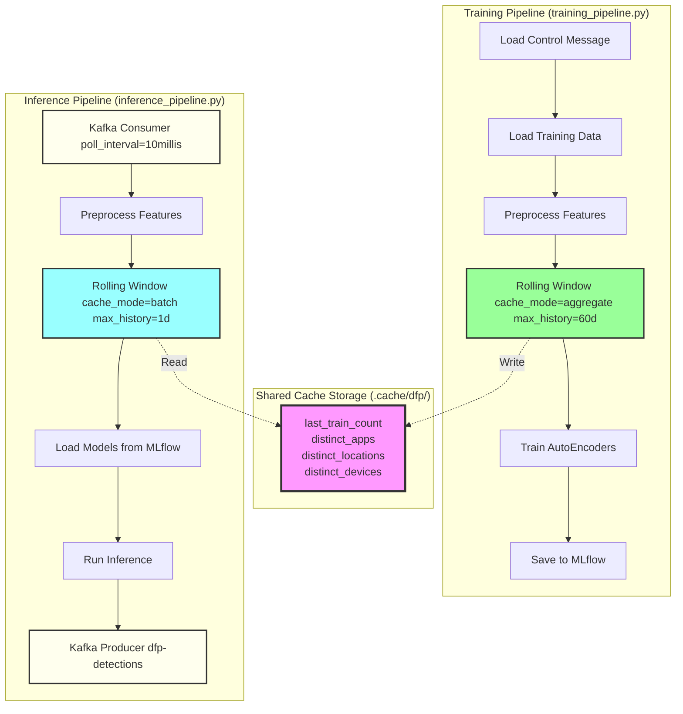

### Modular Architecture Benefits

**Training Pipeline (training_pipeline.py)**:

```text
Training Pipeline:
  - Loads data from files (batch processing)
  - Populates cache with last_train_count
  - cache_mode="aggregate" preserves cache to disk
  - Models saved to MLflow Registry
  - Cache directory: .cache/dfp/
```

**Inference Pipeline (inference_pipeline.py)**:

```text
Inference Pipeline:
  - Consumes events from Kafka (real-time streaming)
  - Reads cache from disk (shared directory)
  - cache_mode="batch" reads last_train_count
  - Loads models from MLflow
  - Publishes detections to Kafka
  - Cache directory: .cache/dfp/ (SAME as training)
```

**Shared Cache Mechanism**:

```text
1. Training writes cache to .cache/dfp/{username}/ (aggregate mode)
2. Cache persisted to disk with last_train_count
3. Inference reads from same .cache/dfp/{username}/ (batch mode)
4. Training uses aggregate mode (write), inference uses batch mode (read)
5. Increment features calculated correctly using shared baseline
```

### Cache Modes Explained

**cache_mode="aggregate"** (Training Only):

- Accumulates statistics continuously
- Updates cache on every window
- Persists `last_train_count`, distinct values to disk
- Preserves cache state across pipeline runs
- Training: max_history="60d" (60-day window)

**cache_mode="batch"** (Inference Only):

- Reloads cache from disk on each event
- Reads `last_train_count` from training baseline
- Preserves training baseline across inference events
- Does not modify cache (read-only)
- Inference: max_history="1d" (1-day window)

**Key Difference**:

- Training (aggregate mode): Writes cache to disk, accumulates statistics
- Inference (batch mode): Reads cache from disk, preserves training baseline
- Both pipelines share same cache directory for cross-process communication

### Pipeline Implementation

**Training Pipeline (training_pipeline.py)**:

```python
class DFPTrainingPipeline:
    def __init__(self, config):
        self.cache_dir = ".cache/dfp"
        self.config = config

    def build_pipeline(self):
        # File-based data loading
        file_to_df = FileToDataFrame()
        user_splitter = UserSplitter(userid_column="username")

        # Rolling window with aggregate mode
        rolling_window = RollingWindow(
            cache_dir=self.cache_dir,
            cache_mode="aggregate",
            max_history="60d",
            min_history=300
        )

        # Training modules
        dfp_trainer = DFPTrainer(config=self.config)
        mlflow_writer = MLflowModelWriter()

        # Chain modules
        return file_to_df >> user_splitter >> rolling_window >> dfp_trainer >> mlflow_writer
```

**Inference Pipeline (inference_pipeline.py)**:

```python
class DFPInferencePipeline:
    def __init__(self, config):
        self.cache_dir = ".cache/dfp"  # SAME as training
        self.config = config

    def build_pipeline(self):
        # Kafka streaming
        kafka_consumer = KafkaConsumer(
            bootstrap_servers="127.0.0.1:29092",
            topic="dfp-events",
            poll_interval="10millis"
        )
        user_splitter = UserSplitter(userid_column="username")

        # Rolling window with batch mode (reads cache)
        rolling_window = RollingWindow(
            cache_dir=self.cache_dir,  # Reads from training cache
            cache_mode="batch",
            max_history="1d",
            min_history=1
        )

        # Inference modules
        dfp_inference = DFPInference(mlflow_uri="http://localhost:5001")
        kafka_producer = KafkaProducer(topic="dfp-detections")

        # Chain modules
        return kafka_consumer >> user_splitter >> rolling_window >> dfp_inference >> kafka_producer
```

---

## Module Architecture

### Module Organization

```text
modules/
├── control/              # Control message routing
│   ├── control_message.py
│   └── message_router.py
├── dfencoder/            # AutoEncoder implementation
│   ├── autoencoder.py
│   ├── ae_module.py
│   ├── dataloader.py
│   └── scalers.py
├── preprocessing/        # Data transformation
│   ├── dfp_preprocessing.py
│   ├── geographic_features.py
│   ├── rolling_window.py
│   ├── user_splitting.py
│   ├── data_prep.py
│   ├── column_info.py
│   └── schema_builder.py
├── training/             # Model training
│   ├── dfp_trainer.py
│   ├── autoencoder_wrapper.py
│   ├── mlflow_model_writer.py
│   └── evaluation.py
├── inference/            # Anomaly detection
│   ├── dfp_inference.py         # DFP AutoEncoder inference
│   ├── filter_detections.py     # Binary filtering (NVIDIA standard)
│   ├── postprocessing.py
│   └── serialization.py
├── io/                   # Data I/O
│   ├── file_batcher.py
│   ├── file_to_df.py
│   ├── df_to_output.py
│   ├── kafka_consumer.py
│   └── kafka_producer.py
└── utils/                # Shared utilities
    ├── config_utils.py
    ├── logging_utils.py
    ├── mlflow_utils.py
    ├── environment_utils.py
    └── cached_user_window.py
```

### Module Dependency Graph

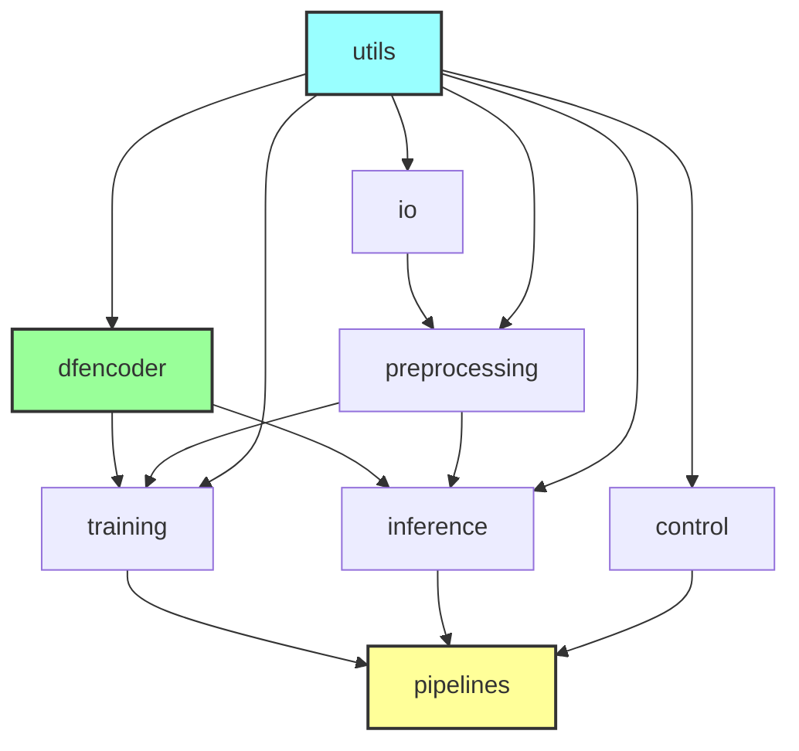

### Module Interfaces

#### Control Module

**Input**: Control messages (JSON)
**Output**: Routed tasks (training/inference)
**Responsibility**: Task routing and coordination

#### DFEncoder Module

**Input**: Feature DataFrames
**Output**: Trained models, reconstruction errors
**Responsibility**: AutoEncoder training and inference

#### Preprocessing Module

**Input**: Raw event DataFrames
**Output**: Aggregated feature DataFrames
**Responsibility**: Feature engineering and aggregation

#### Training Module

**Input**: Training DataFrames, configuration
**Output**: MLflow models with metadata
**Responsibility**: Model training and evaluation

#### Inference Module

**Input**: Inference DataFrames, MLflow models
**Output**: Anomaly detections with comprehensive feature details
**Responsibility**: DFP AutoEncoder inference and FilterDetections binary filtering

**Detection Process**:

- DFP AutoEncoder: Behavioral + geographic anomaly detection
  - Trained on all features including travel_speed_kmph
  - Computes reconstruction errors for all features
  - Calculates z-scores based on training baseline
- FilterDetections: NVIDIA standard binary filtering
  - Threshold: mean_abs_z > 2.0 (configurable)
  - Returns None if no anomalies exceed threshold
  - Comprehensive detection messages with all feature details

#### IO Module

**Input**: Files, Kafka streams
**Output**: Pandas DataFrames
**Responsibility**: Data ingestion and output

#### Utils Module

**Input**: Configuration, system state
**Output**: Logging, config, MLflow helpers
**Responsibility**: Cross-cutting concerns

---

## Data Flow Diagrams

### Training Data Flow

```mermaid
graph LR
    A[Azure AD Logs<br/>JSON] --> B[File Loader]
    B --> C[Raw DataFrame<br/>timestamp, username, ...]
    C --> D[DFP Preprocessing]
    D --> E[Processed DataFrame<br/>+ temporal features]
    E --> F[User Splitter]
    F --> G[Per-User DataFrames]
    G --> H[Rolling Window]
    H --> I[Aggregated Features<br/>24h windows]
    I --> J[Data Preparation]
    J --> K[Training Matrix<br/>X_train, X_val]
    K --> L[AutoEncoder]
    L --> M[Trained Model<br/>.pth]
    M --> N[MLflow Registry<br/>DFP-username]

    H -.->|Cache Write| O[Cache Storage<br/>last_train_count]

    style A fill:#ffe,stroke:#333
    style N fill:#9f9,stroke:#333,stroke-width:2px
    style O fill:#f9f,stroke:#333,stroke-width:2px
```

### Inference Data Flow

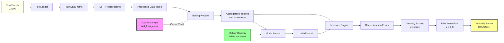

### Feature Engineering Flow

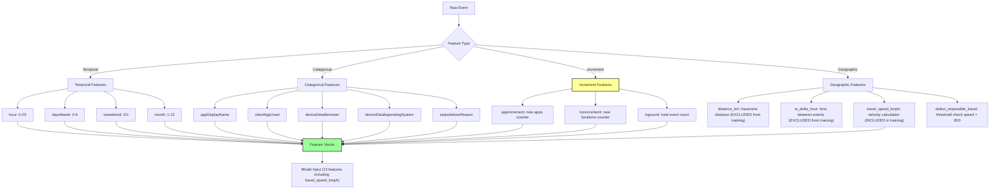

---

## Control Message Routing

### Control Message Structure

```json
{
  "tasks": [
    {
      "type": "training|inference",
      "properties": {
        "data_path": "path/to/data",
        "cache_mode": "aggregate|batch",
        "timestamp_column": "timestamp",
        "userid_column": "username",
        "min_history": 300,
        "epochs": 100
      }
    }
  ],
  "metadata": {
    "description": "Task description",
    "created": "2025-11-20"
  }
}
```

### Routing Decision Flow

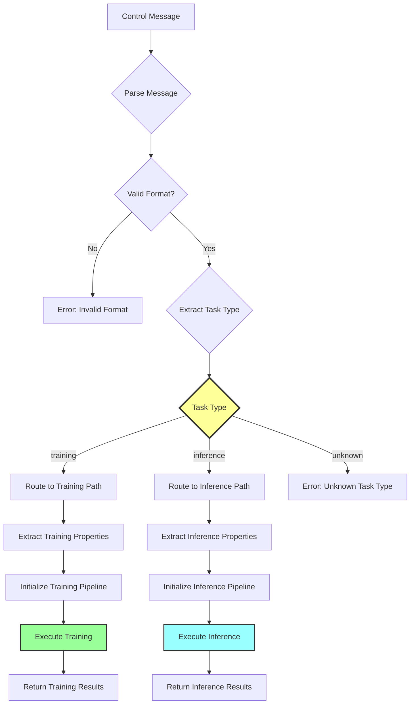

### Control Message Examples

**Training Message**:

```json
{
  "tasks": [
    {
      "type": "training",
      "properties": {
        "data_path": "data/input/train/azure_ad_train.jsonl",
        "cache_mode": "aggregate",
        "min_history": 300,
        "min_increment": 300,
        "max_history": "60d",
        "epochs": 100,
        "mlflow_uri": "http://localhost:5001"
      }
    }
  ]
}
```

**Inference Message**:

```json
{
  "tasks": [
    {
      "type": "inference",
      "properties": {
        "data_path": "data/input/control/azure_ad_eval.jsonl",
        "cache_mode": "batch",
        "threshold": 3.0,
        "model_version": "latest"
      }
    }
  ]
}
```

---

## MLflow Integration

### MLflow Architecture

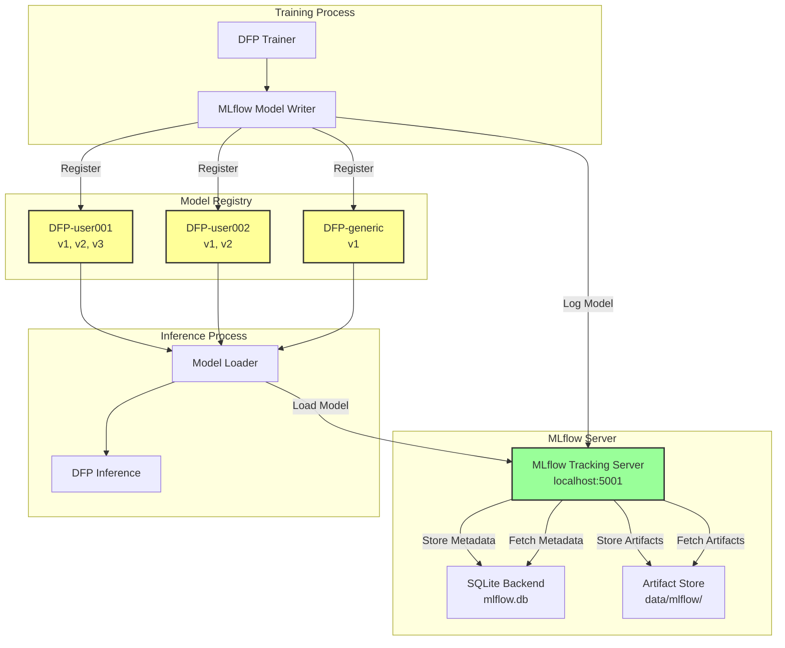

### MLflow Model Naming Convention

**Pattern**: `DFP-{user_id}`

**Examples**:

- User-specific models: `DFP-user001`, `DFP-user002`, `DFP-alice@company.com`
- Generic model: `DFP-generic`

**Model Versioning**:

- Incremental: v1, v2, v3, ...
- Latest: `version="latest"`
- Production: `stage="Production"`

### Model Metadata Structure

```yaml
model_name: "DFP-user001"
version: 2
created_timestamp: "2025-11-20T10:30:00Z"
user_id: "user001"
training_samples: 450
validation_loss: 0.023
baseline_statistics:
  mean_reconstruction_error: 0.015
  std_reconstruction_error: 0.008
  p95_reconstruction_error: 0.031
feature_columns:
  - appDisplayName
  - clientAppUsed
  - logcount
  - locincrement
  - appincrement
model_config:
  encoder_layers: [512, 500]
  decoder_layers: [512]
  learning_rate: 0.01
  epochs: 100
```

### MLflow Integration Points

**Training Phase**:

1. Start MLflow run
2. Log hyperparameters (epochs, learning_rate, batch_size)
3. Log training metrics (loss per epoch)
4. Save trained model artifact (.pth file)
5. Log baseline statistics (mean/std reconstruction error)
6. Register model in MLflow Registry

**Inference Phase**:

1. Query MLflow for model (user-specific or generic)
2. Load model artifact
3. Load baseline statistics for z-score calculation
4. Log inference metrics (detection rate, throughput)

---

## Kafka Streaming Architecture

### Kafka Integration Overview

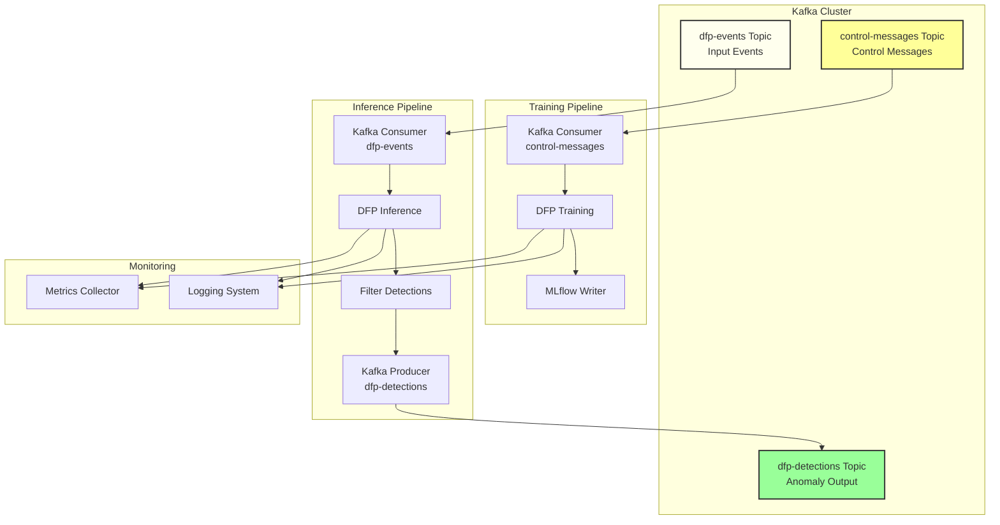

### Kafka Consumer Configuration

```yaml
kafka:
  bootstrap_servers: "127.0.0.1:29092"

  consumer:
    group_id: "morpheus-dfp-inference"
    auto_offset_reset: "latest" # Only new events
    enable_auto_commit: true
    poll_interval: "10millis"
    max_poll_records: 500
```

### Kafka Producer Configuration

```yaml
kafka:
  producer:
    acks: "1" # Leader acknowledgment
    compression_type: "gzip"
    batch_size: 16384
    async_commits: true
```

### Event Flow (Streaming Mode)

```text
1. Event arrives in dfp-events topic
2. Kafka Consumer polls event (10ms interval, NVIDIA default)
3. Preprocess event (feature extraction using feature_schema.yaml)
4. Apply rolling window (cache_mode="batch", max_history="1d")
5. Calculate increment features using cached last_train_count
6. Load model from MLflow (user-specific or generic fallback)
7. Compute reconstruction error
8. Calculate z-score using baseline statistics
9. If z > 3.0: Anomaly detected
10. Publish detection to dfp-detections topic
11. Acknowledge event
12. Expose metrics at http://localhost:8000/metrics
```

---

## Deployment Architectures

### Single-Node Development Deployment

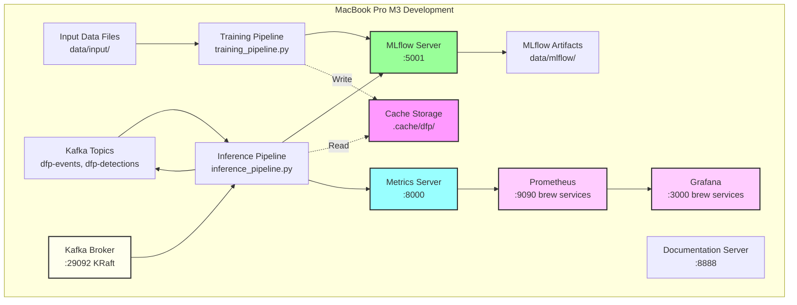

**Characteristics**:

- Single machine execution
- CPU-based training (M3 MacBook)
- Native services (tmux-managed)
- Kafka KRaft mode (no Zookeeper)
- Real-time streaming inference
- API documentation server (:8888)
- Prometheus metrics endpoint (:8000, :9090)
- Grafana dashboards (:3000)
- Automatic monitoring service management (brew services)
- Development and testing

**Service Management**:

```bash
# Start all services (including Prometheus/Grafana)
./services/start_services.sh

# Restart all services (convenience wrapper)
./services/restart_services.sh [inference|training]

# Stop all services (including Prometheus/Grafana)
./services/stop_services.sh

# Check service status
./services/check_services.sh
```

Services managed:

- MLflow Tracking Server (:5001)
- Kafka KRaft (:29092)
- Kafka UI (:8080, optional)
- API Documentation Server (:8888, Sphinx)
- Metrics Server (:8000, pipeline-integrated)
- Pushgateway (:9091, batch metrics persistence)
- Prometheus (:9090, auto-started via brew services)
- Grafana (:3000, auto-started via brew services)

### Production Deployment (GPU)

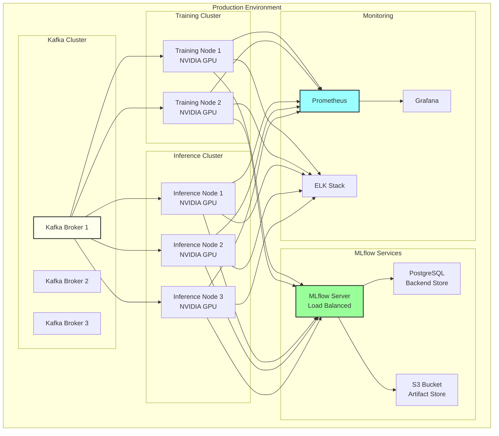

**Characteristics**:

- Multi-node distributed execution
- GPU acceleration (CUDA)
- Kafka streaming
- Scalable MLflow (PostgreSQL + S3)
- Comprehensive monitoring
- High availability

### Docker Deployment

```yaml
# docker-compose.yaml
services:
  mlflow:
    image: ghcr.io/mlflow/mlflow:latest
    ports:
      - "5001:5001"
    volumes:
      - ./data/mlflow:/mlflow/artifacts
    command: mlflow server --host 0.0.0.0 --port 5001

  kafka:
    image: confluentinc/cp-kafka:latest
    ports:
      - "29092:29092"
    environment:
      - KAFKA_PROCESS_ROLES=broker,controller
      - KAFKA_NODE_ID=1
      - KAFKA_LISTENERS=PLAINTEXT://0.0.0.0:29092
      - KAFKA_CONTROLLER_QUORUM_VOTERS=1@kafka:9093

  training-pipeline:
    build:
      context: .
      dockerfile: docker/Dockerfile.cpu
    volumes:
      - ./data:/app/data
      - ./config:/app/config
      - ./.cache:/app/.cache # Shared cache
    environment:
      - MLFLOW_TRACKING_URI=http://mlflow:5001
    command: python pipelines/pipeline.py training --config config/pipeline.yaml

  inference-pipeline:
    build:
      context: .
      dockerfile: docker/Dockerfile.cpu
    volumes:
      - ./data:/app/data
      - ./config:/app/config
      - ./.cache:/app/.cache # Shared cache
    environment:
      - MLFLOW_TRACKING_URI=http://mlflow:5001
    command: |
      python pipelines/pipeline.py inference \
        --config config/pipeline.yaml \
        --kafka-bootstrap kafka:29092
    depends_on:
      - kafka
      - mlflow
      - training-pipeline

  metrics-server:
    build:
      context: .
      dockerfile: docker/Dockerfile.cpu
    ports:
      - "8000:8000"
    command: python -m modules.utils.metrics_server
```

---

## Cache Management

### Cache Architecture

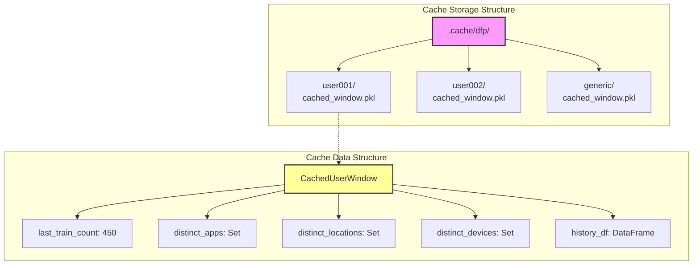

### Cache Operations

**Training (cache_mode="aggregate", max_history="60d")**:

```python
# Load existing cache from disk
cache = load_cache(user_id, cache_dir=".cache/dfp")

# Process new data
new_events = preprocess(raw_data)

# Update cache
cache.last_train_count = len(new_events)
cache.distinct_apps.update(new_events['app'].unique())
cache.distinct_locations.update(new_events['location'].unique())
cache.history_df = append(cache.history_df, new_events)

# Save cache to disk (persistent)
save_cache(user_id, cache, cache_dir=".cache/dfp")
```

**Inference (cache_mode="batch", max_history="1d")**:

```python
# Load cache from disk (written by training)
cache = load_cache(user_id, cache_dir=".cache/dfp")

# Calculate increment features using cached baseline
new_apps = set(current_data['app']) - cache.distinct_apps
logcount = len(current_data) + cache.last_train_count
appincrement = len(new_apps)
locincrement = len(set(current_data['location']) - cache.distinct_locations)

# Use for inference
features = compute_features(current_data, cache)

# Cache reloads from disk on each event (read-only)
# Batch mode preserves training baseline without modifications
```

### Cache Lifecycle

```text
TRAINING PIPELINE (training_pipeline.py):
  1. Load cache from disk (.cache/dfp/{username}/)
  2. Process training data (60-day window)
  3. Update cache statistics (last_train_count, distinct values)
  4. Train models and save to MLflow
  5. Save cache to disk (persistent)
  6. Exit (cache remains on disk)

INFERENCE PIPELINE (inference_pipeline.py):
  1. Start Kafka consumer
  2. For each incoming event:
     a. Reload cache from disk (.cache/dfp/{username}/) - batch mode
     b. Calculate increment features using cached baseline
     c. Run inference
     d. Publish detection to Kafka
  3. Cache is read-only (batch mode, preserves training baseline)
  4. Continue processing events (real-time streaming)

SHARED CACHE:
  - Directory: .cache/dfp/
  - Both pipelines use same cache directory
  - Training writes, inference reads
  - Persisted to disk for cross-process sharing
```

---

## Security Architecture

### Authentication & Authorization

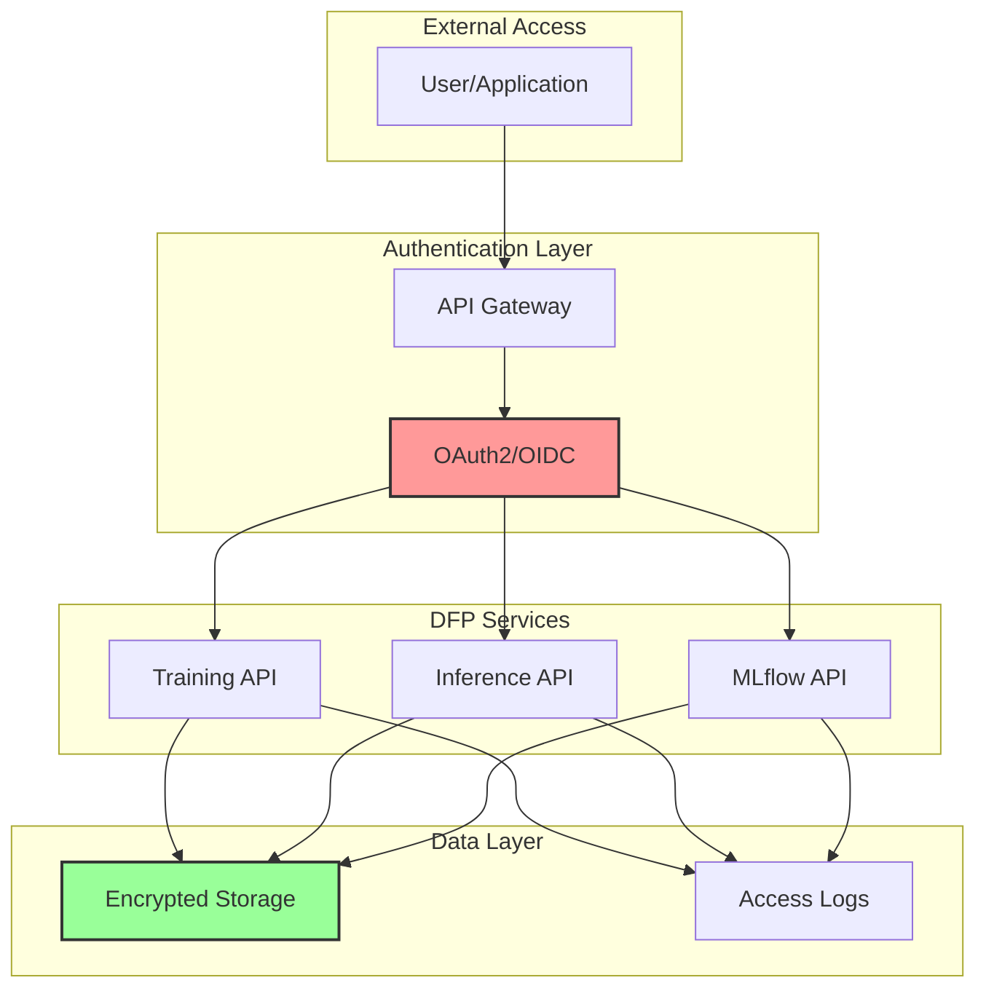

### Data Security

**Encryption**:

- Data at rest: AES-256 encryption
- Data in transit: TLS 1.3
- Model artifacts: Encrypted in MLflow

**Access Control**:

- Role-based access control (RBAC)
- Least privilege principle
- Audit logging

**Compliance**:

- PII handling: Anonymization/pseudonymization
- GDPR compliance: Right to deletion
- Data retention policies

---

## Performance Considerations

### Bottleneck Analysis

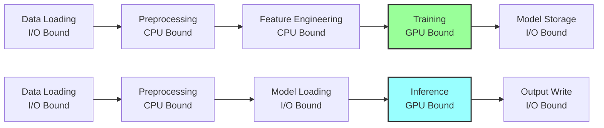

### Optimization Strategies

**Training Optimization**:

1. **Batch Size**: Maximize GPU utilization (512-2048)
2. **Data Loading**: Multi-process data loading (num_workers=4)
3. **Model Caching**: Cache trained models in memory
4. **Early Stopping**: Avoid unnecessary epochs

**Inference Optimization**:

1. **Model Caching**: Keep models in memory (cache last 10 models)
2. **Batch Inference**: Process multiple users in parallel
3. **Feature Caching**: Reuse preprocessing results
4. **Streaming**: Real-time processing via Kafka

### Performance Metrics

**Training Metrics**:

- Training time per user: ~5-10 seconds (CPU), ~1-2 seconds (GPU)
- Throughput: ~100-150 users/minute (CPU), ~500-1000 users/minute (GPU)
- Memory usage: ~2-3GB (training), ~500MB (baseline)

**Inference Metrics**:

- Latency (p50): ~2-3ms per event (CPU), ~0.5-1ms (GPU)
- Throughput: ~500-700 events/second (CPU), ~3000-5000 events/second (GPU)
- Detection rate: ~11% (NVIDIA benchmark)

---

## References

### NVIDIA Morpheus Documentation

1. **Digital Fingerprinting Guide**

   - <https://docs.nvidia.com/morpheus/developer_guide/guides/5_digital_fingerprinting.html>

2. **Modular Pipeline Guide**

   - <https://docs.nvidia.com/morpheus/developer_guide/guides/10_modular_pipeline_digital_fingerprinting.html>

3. **DFP Training Module**

   - <https://docs.nvidia.com/morpheus/modules/examples/digital_fingerprinting/dfp_training.html>

4. **DFP Inference Module**
   - <https://docs.nvidia.com/morpheus/modules/examples/digital_fingerprinting/dfp_inference.html>

### NVIDIA Morpheus Repository

- **GitHub**: <https://github.com/nv-morpheus/Morpheus>
- **Branch**: `branch-25.10`
- **Training Reference**: `python/morpheus_dfp/morpheus_dfp/modules/dfp_training_pipe.py`
- **Inference Reference**: `python/morpheus_dfp/morpheus_dfp/modules/dfp_inference_pipe.py`

### Related Documentation

- [Module Documentation](../../modules/README.md)
- [Pipeline Documentation](../../pipelines/README.md)
- [Configuration Guide](../../config/README.md)
- [Developer Guide](../DEVELOPER_GUIDE.md)
- [Monitoring Guide](MONITORING.md)

### Implementation Files

- Training Pipeline: `pipelines/training_pipeline.py`
- Inference Pipeline: `pipelines/inference_pipeline.py`
- Main Orchestrator: `pipelines/pipeline.py`
- Feature Schema: `config/feature_schema.yaml`
- Pipeline Config: `config/pipeline.yaml`

---

**Document Version**: 2.0  
**Last Updated**: January 2025  
**Author**: Tomasz Zabek <tzabek@deloitte.co.uk>  
**Generated By**: Claude Sonnet 4.5

**Changelog**:

- v2.0 (January 2025): Updated to reflect modular pipeline architecture (training_pipeline.py + inference_pipeline.py)
- v1.0 (November 2025): Initial architecture documentation
